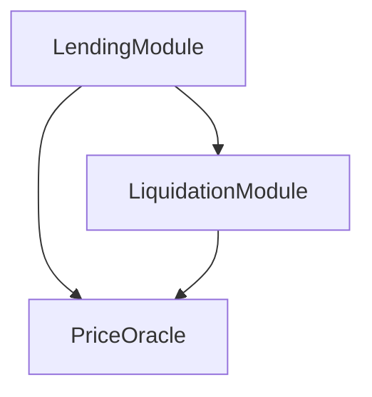

# FSCA CLI — Complete User Guide

> **Full Stack Contract Architecture** — Smart Contract Cluster Orchestrator for EVM chains

[🇨🇳 中文版](user-guide.zh-CN.md)

---

## Table of Contents

1. [Quick Start](#quick-start)
2. [Core Concepts](#core-concepts)
3. [Installation & Configuration](#installation--configuration)
4. [Command Reference](#command-reference)
5. [Complete Workflows](#complete-workflows)
6. [Advanced Usage](#advanced-usage)
7. [Best Practices](#best-practices)
8. [Troubleshooting](#troubleshooting)

---

## Quick Start

### 5-Minute Setup

```bash
# 1. Install
npm install -g fsca-cli

# 2. Create project
mkdir my-defi-project && cd my-defi-project

# 3. Initialize
fsca init

# 4. Deploy cluster backbone
fsca cluster init

# 5. Deploy your first contract
fsca deploy --contract MyFirstPod

# 6. Mount it to the cluster
fsca cluster mount 1 "MyFirstPod"

# 7. Check cluster status
fsca cluster list mounted
```

---

## Core Concepts

### What is FSCA?

FSCA brings **microservice architecture** to smart contract development, resolving the fundamental tension between contract immutability and business agility.

### Core Components

```
┌─────────────────────────────────────────┐
│        ClusterManager (Orchestrator)    │
│  - Contract registry                   │
│  - Operator permission management      │
│  - Cluster lifecycle control           │
└─────────────────────────────────────────┘
                    │
        ┌───────────┴───────────┐
        ▼                       ▼
┌──────────────┐        ┌──────────────┐
│ EvokerManager│        │ ProxyWallet  │
│ (Topology)   │        │ (Governance) │
│  - Dep graph │        │  - Multi-sig │
│  - Auth mesh │        │  - Threshold │
└──────────────┘        └──────────────┘
        │
        ▼
┌─────────────────────────────────────────┐
│              Pod (Business Module)      │
│  - Extends NormalTemplate              │
│  - Independent deploy & upgrade        │
│  - Connected via Link mechanism        │
└─────────────────────────────────────────┘
```

### Key Terminology

| Term | Description | Kubernetes Analogy |
|------|-------------|-------------------|
| **Cluster** | System-wide boundary for all services | Kubernetes Cluster |
| **Pod** | Isolated, single-responsibility contract unit | Kubernetes Pod |
| **Mount** | Register a Pod into the Cluster | Service going live |
| **Link** | Establish a connection between Pods | Service discovery |
| **Active Link** | This pod calls another pod | Client → Server |
| **Passive Link** | This pod is called by another pod | Server ← Client |

---

## Installation & Configuration

### Option 1: Global Install (recommended)

```bash
npm install -g fsca-cli
fsca --version
```

### Option 2: Install from Source

```bash
git clone https://github.com/Steve65535/fsca-cli.git
cd fsca-cli
npm link
fsca --version
```

### Project Initialization

```bash
# Interactive setup
fsca init

# Non-interactive with flags
fsca init \
  --networkName "sei-testnet" \
  --rpc "https://evm-rpc-testnet.sei-apis.com" \
  --chainId 1328 \
  --accountPrivateKey "0x..." \
  --address "0x..."
```

### Configuration: `project.json`

```json
{
  "network": {
    "name": "sei-testnet",
    "rpc": "https://evm-rpc-testnet.sei-apis.com",
    "chainId": 1328,
    "blockConfirmations": 1
  },
  "account": {
    "address": "0x...",
    "privateKey": "0x..."
  },
  "fsca": {
    "clusterAddress": "0x...",
    "evokerAddress": "0x...",
    "proxyWalletAddress": "0x...",
    "currentOperating": "0x...",
    "alldeployedcontracts": [],
    "runningcontracts": [],
    "unmountedcontracts": []
  }
}
```

---

## Command Reference

### Foundation Commands

#### `fsca init`

Initialize an FSCA project environment.

```bash
fsca init
fsca init --networkName "mainnet" --rpc "https://..." --chainId 1
```

**What it does:**
- ✅ Initializes Hardhat environment
- ✅ Copies fsca-core contract library
- ✅ Generates `project.json` config
- ✅ Configures network and account

---

#### `fsca deploy --contract <ContractName>`

Compile and deploy a contract that extends `NormalTemplate`.

```bash
fsca deploy --contract LendingModule
fsca deploy --contract PriceOracle --description "Price Feed v2"
```

**Parameters:**
- `--contract` (required): Solidity class name used to locate the compiled artifact
- `--description` (optional): Human-readable name (defaults to contract name)

**Execution flow:**
1. Compiles contracts (`npx hardhat compile`)
2. Deploys the contract instance
3. Updates `project.json` cache
4. Auto-sets `currentOperating` to the new contract

---

### Cluster Management

#### `fsca cluster init`

Deploy the FSCA orchestration backbone.

```bash
fsca cluster init
fsca cluster init --threshold 2
```

**Deploys:**
1. MultiSigWallet (multi-sig wallet)
2. ClusterManager (registry & router)
3. EvokerManager (topology & auth)
4. ProxyWallet (governance proxy)

---

#### `fsca cluster mount <id> <name>`

Register a contract into the cluster.

```bash
fsca cluster mount 1 "LendingModule"
```

**Parameters:**
- `id`: Unique contract ID within the cluster (uint32)
- `name`: Human-readable name

**Prerequisites:**
- ✅ Contract deployed via `fsca deploy`, or
- ✅ Contract selected via `fsca cluster choose`

**Execution flow:**
1. Calls `ClusterManager.registerContract(id, name, address)`
2. Auto-assigns `contractId` and `proxyWalletAddr`
3. Calls `EvokerManager.mount()` to establish topology
4. Updates local cache (unmounted → running)

---

#### `fsca cluster unmount <id>`

Deregister a contract from the cluster.

```bash
fsca cluster unmount 1
```

**Execution flow:**
1. Calls `ClusterManager.deleteContract(id)`
2. Automatically removes all Link relationships
3. Calls `EvokerManager.unmount()` with neighbor unlocking
4. Updates local cache (running → unmounted)

---

#### `fsca cluster upgrade --id <id> --contract <ContractName>`

Hot-swap a contract version with zero downtime.

```bash
fsca cluster upgrade --id 2 --contract PriceOracleV2
fsca cluster upgrade --id 2 --contract PriceOracleV2 --skip-copy-pods
```

**Parameters:**
- `--id` (required): Contract ID to replace
- `--contract` (required): New contract's Solidity class name
- `--skip-copy-pods` (optional): Skip copying dependency config from the old contract

**What happens:**
1. Captures the old contract's link topology
2. Unmounts the old contract
3. Deploys the new contract
4. Copies link configuration (unless `--skip-copy-pods`)
5. Mounts the new contract at the same ID
6. Dependent contracts automatically resolve the new address

---

#### `fsca cluster choose <address>`

Set the active working context to a specific contract.

```bash
fsca cluster choose 0x123...
```

Switches the contract that subsequent `mount`, `link`, and `normal` commands will operate on.

---

#### `fsca cluster current`

Display info about the currently selected contract.

```bash
fsca cluster current
```

**Output example:**
```
╔═══════════════════════════════════════════════════╗
║  Current Operating Contract                       ║
╠═══════════════════════════════════════════════════╣
║  Address:  0x1234...abcd                          ║
║  Name:     LendingPod                             ║
║  ID:       1                                      ║
║  Status:   ✓ MOUNTED                              ║
║  Deployed: 2/3/2026, 1:00:00 PM                   ║
╚═══════════════════════════════════════════════════╝
```

---

#### `fsca cluster link <type> <targetAddress> <targetId>`

Create a dependency link between contracts.

```bash
# Active link (current contract → target)
fsca cluster link active 0x789... 2

# Passive link (target → current contract)
fsca cluster link passive 0xabc... 3
```

**Link types:**
```
Active Link:   CurrentPod ──calls──> TargetPod
Passive Link:  TargetPod  ──calls──> CurrentPod
```

**Behavior:**
- **Unmounted contracts**: Directly modifies the Pod's internal active/passive arrays
- **Mounted contracts**: Routes through EvokerManager for dynamic topology update

---

#### `fsca cluster unlink <type> <targetAddress> <targetId>`

Remove a dependency link (mounted contracts only).

```bash
fsca cluster unlink active 0x789... 2
```

---

#### `fsca cluster list <scope>`

List contracts in the cluster.

```bash
fsca cluster list mounted    # Active contracts only
fsca cluster list all        # Including deregistered
```

---

#### `fsca cluster info <id>`

Inspect a contract's metadata.

```bash
fsca cluster info 1
```

---

#### `fsca cluster graph`

Generate a Mermaid topology diagram of the cluster.

```bash
fsca cluster graph
```

**Output example:**


---

#### `fsca cluster operator <action> [address]`

Manage cluster operators.

```bash
fsca cluster operator list
fsca cluster operator add 0xdef...
fsca cluster operator remove 0xdef...
```

**Permission levels:**
- `rootAdmin`: Can add/remove operators
- `operator`: Can register/delete contracts, manage links

---

### Permission Management

#### `fsca normal right set <abiId> <maxRight>`

Set ABI-level permission for a function.

```bash
fsca normal right set 0x1234... 2
```

#### `fsca normal right remove <abiId>`

Remove ABI permission.

```bash
fsca normal right remove 0x1234...
```

#### `fsca normal get modules <type>`

Query linked modules.

```bash
fsca normal get modules active
fsca normal get modules passive
```

---

### Multi-Sig Wallet

#### `fsca wallet submit`

Submit a new transaction to the multi-sig wallet.

```bash
fsca wallet submit --to 0xCluster... --value 0 --data 0xabcdef...
```

#### `fsca wallet confirm <txIndex>`

Confirm a pending transaction.

```bash
fsca wallet confirm 0
```

#### `fsca wallet execute <txIndex>`

Execute a transaction that has reached the required threshold.

```bash
fsca wallet execute 0
```

#### `fsca wallet revoke <txIndex>`

Revoke a previous confirmation.

```bash
fsca wallet revoke 0
```

#### `fsca wallet list`

List all or pending transactions.

```bash
fsca wallet list
fsca wallet list --pending
```

#### `fsca wallet info <txIndex>`

View transaction details including confirmation status.

```bash
fsca wallet info 0
```

#### `fsca wallet owners`

View all owners and the current threshold.

```bash
fsca wallet owners
```

#### `fsca wallet propose`

Propose governance changes.

```bash
fsca wallet propose add-owner 0xNewOwner...
fsca wallet propose remove-owner 0xOldOwner...
fsca wallet propose change-threshold 3
```

---

## Complete Workflows

### Scenario 1: Build a Lending System

```bash
# 1. Initialize
mkdir defi-lending && cd defi-lending
fsca init

# 2. Deploy cluster
fsca cluster init

# 3. Deploy business contracts
fsca deploy --contract LendingPod
fsca deploy --contract PriceOracle
fsca deploy --contract LiquidationPod

# 4. Wire dependencies (before mounting)
fsca cluster choose <LendingPod-Address>
fsca cluster link active <PriceOracle-Address> 2
fsca cluster link active <LiquidationPod-Address> 3

fsca cluster choose <LiquidationPod-Address>
fsca cluster link active <PriceOracle-Address> 2

# 5. Mount all
fsca cluster choose <LendingPod-Address>
fsca cluster mount 1 "LendingPod"

fsca cluster choose <PriceOracle-Address>
fsca cluster mount 2 "PriceOracle"

fsca cluster choose <LiquidationPod-Address>
fsca cluster mount 3 "LiquidationPod"

# 6. Verify topology
fsca cluster graph
fsca cluster list mounted
```

**Resulting topology:**
```
LendingPod (1)
  ├─> PriceOracle (2)
  └─> LiquidationPod (3)
        └─> PriceOracle (2)
```

---

### Scenario 2: Upgrade a Module

```bash
# One-command hot swap
fsca cluster upgrade --id 1 --contract LendingPodV2

# Or manual step-by-step:
fsca deploy --contract LendingPodV2
fsca cluster choose <LendingPodV2-Address>
fsca cluster link active <PriceOracle-Address> 2
fsca cluster link active <LiquidationPod-Address> 3
fsca cluster unmount 1
fsca cluster mount 1 "LendingPodV2"
```

**Benefits:**
- ✅ Zero-downtime upgrade
- ✅ Instant rollback possible
- ✅ Other modules remain unaffected

---

### Scenario 3: Add a New Module

```bash
fsca deploy --contract StakingPod
fsca cluster choose <StakingPod-Address>
fsca cluster link active <LendingPod-Address> 1
fsca cluster mount 4 "StakingPod"
fsca cluster graph   # verify updated topology
```

---

## Advanced Usage

### Writing a Custom Pod

```solidity
// contracts/MyLendingPod.sol
pragma solidity ^0.8.21;

import "../undeployed/lib/normaltemplate.sol";

contract MyLendingPod is normalTemplate {
    
    constructor(address _clusterAddress) 
        normalTemplate(_clusterAddress, "MyLendingPod") 
    {}
    
    // ABI-level permission check
    function borrow(uint256 amount) 
        external 
        checkAbiRight(keccak256("borrow(uint256)"))
    {
        // Business logic
    }
    
    // Verify caller is the Liquidation module (ID = 3)
    function liquidate(address user)
        external
        activeModuleVerification(3)
    {
        // Liquidation logic
    }
}
```

### Multi-Environment Management

```bash
cp project.json project.dev.json      # dev
cp project.json project.test.json     # testnet
cp project.json project.prod.json     # mainnet

# Switch environment
cp project.prod.json project.json
```

### Batch Deploy Script

```bash
#!/bin/bash
PODS=("Lending" "PriceOracle" "Liquidation" "Staking")

for pod in "${PODS[@]}"; do
  echo "Deploying $pod..."
  fsca deploy --contract "$pod"
done
```

### Event Monitoring

```javascript
const { ethers } = require('ethers');
const config = require('../project.json');

async function main() {
  const provider = new ethers.JsonRpcProvider(config.network.rpc);
  const cluster = new ethers.Contract(
    config.fsca.clusterAddress,
    ClusterManagerABI,
    provider
  );
  
  cluster.on("ContractCalled", (caller, target, abiName, success) => {
    console.log(`Call: ${caller} -> ${target}.${abiName} [${success}]`);
  });
}

main();
```

---

## Best Practices

### 1. Naming Conventions

```bash
# ✅ Good
fsca deploy --contract LendingModule
fsca deploy --contract PriceOracleV2

# ❌ Avoid
fsca deploy --contract contract1
fsca deploy --contract test
```

### 2. ID Allocation Strategy

```
1-99:    Core modules (Lending, Oracle, etc.)
100-199: Auxiliary modules (Staking, Governance)
200-299: Utility modules (Logger, Monitor)
1000+:   Test modules
```

### 3. Deployment Order

```
1. Infrastructure (PriceOracle, DataFeed)
2. Core business  (Lending, Trading)
3. Auxiliary      (Liquidation, Staking)
4. Governance     (Governor, Timelock)
```

### 4. Plan Before Linking

Sketch your topology before mounting:

```
┌──────────┐     ┌──────────┐
│ Lending  │────>│  Oracle  │
└──────────┘     └──────────┘
      │               ▲
      │               │
      ▼               │
┌──────────┐          │
│Liquidate │──────────┘
└──────────┘
```

### 5. Testing Pipeline

```bash
# 1. Local unit tests
npx hardhat test

# 2. Testnet deployment
fsca init --networkName testnet ...
fsca cluster init
# ... deploy and test

# 3. Mainnet (with multi-sig threshold ≥ 2)
fsca init --networkName mainnet ...
```

---

## Troubleshooting

### `project.json not found`

**Cause:** Project not initialized.
```bash
fsca init
```

### `Cluster address not configured`

**Cause:** Cluster backbone not deployed.
```bash
fsca cluster init
```

### `No valid current operating contract`

**Cause:** No contract deployed or selected.
```bash
fsca deploy --contract MyPod
# or
fsca cluster choose 0x123...
```

### Compilation failures

```bash
npx hardhat clean
npx hardhat compile
```

### Insufficient gas

Check your account balance on the block explorer and request testnet tokens from the corresponding faucet.

### `Not qualified` (permission error)

**Cause:** Current account is not an operator.
```bash
fsca cluster operator add <your-address>
```

---

## Appendix

### A. Quick Reference Card

| Command | Description | Example |
|---------|-------------|---------|
| `fsca init` | Initialize project | `fsca init` |
| `fsca deploy --contract <N>` | Deploy contract | `fsca deploy --contract MyPod` |
| `fsca cluster init` | Deploy cluster | `fsca cluster init --threshold 2` |
| `fsca cluster mount <id> <name>` | Mount contract | `fsca cluster mount 1 "MyPod"` |
| `fsca cluster unmount <id>` | Unmount contract | `fsca cluster unmount 1` |
| `fsca cluster upgrade --id <id> --contract <N>` | Hot-swap | `fsca cluster upgrade --id 1 --contract MyPodV2` |
| `fsca cluster choose <addr>` | Select context | `fsca cluster choose 0x...` |
| `fsca cluster current` | Show current | `fsca cluster current` |
| `fsca cluster link <type> <addr> <id>` | Create link | `fsca cluster link active 0x... 2` |
| `fsca cluster unlink <type> <addr> <id>` | Remove link | `fsca cluster unlink active 0x... 2` |
| `fsca cluster list <scope>` | List contracts | `fsca cluster list mounted` |
| `fsca cluster info <id>` | Inspect contract | `fsca cluster info 1` |
| `fsca cluster graph` | Topology diagram | `fsca cluster graph` |
| `fsca cluster operator list/add/remove` | Manage operators | `fsca cluster operator add 0x...` |
| `fsca wallet submit/confirm/execute/revoke` | Multi-sig TX lifecycle | `fsca wallet confirm 0` |
| `fsca wallet list` | List transactions | `fsca wallet list --pending` |
| `fsca wallet owners` | View signers | `fsca wallet owners` |
| `fsca wallet propose <action>` | Governance proposal | `fsca wallet propose add-owner 0x...` |
| `fsca normal right set/remove` | ABI permissions | `fsca normal right set 0x... 2` |
| `fsca normal get modules <type>` | Query modules | `fsca normal get modules active` |

### B. Links

- **GitHub**: [Steve65535/fsca-cli](https://github.com/Steve65535/fsca-cli)
- **Contributing**: [CONTRIBUTING.md](CONTRIBUTING.md)
- **Security**: [SECURITY.md](SECURITY.md)

---

**Version**: v1.2.0  
**Last updated**: 2026-03-06
